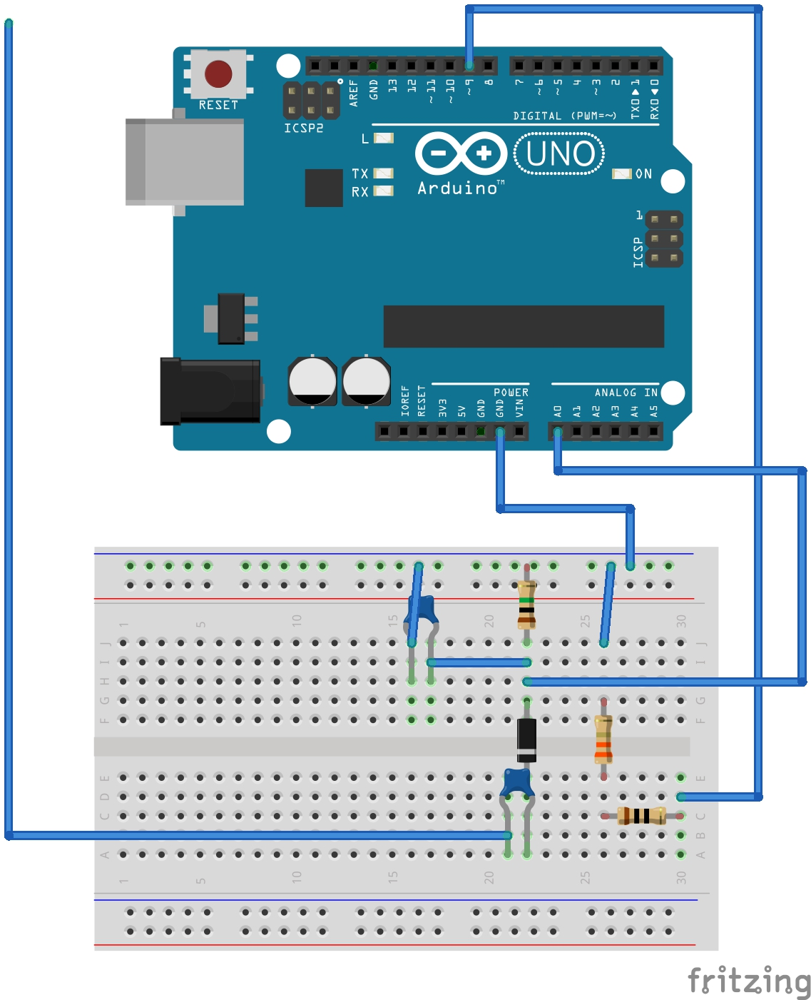

## BioPlayer  
### 概要  
植物に触れて音やパーティクルを描画する作品をつくる。  
アナログとデジタルを融合した作品を目指して制作した。  
  
### 機材  
##### ハード
- Arduino  
- PC
- ワイヤ・抵抗・コンデンサ等部品
- 植物  

##### ソフト
- Arduino
- Processing
- Supercollider

### 回路図  

### 処理の流れ
1. シリアル通信の初期化
2. 植物につないだピンの電圧をprocessingに渡す
3. 受け取った電圧が設定した閾値を超えたら配列にパーティクルアイテムを追加し、supercolliderでサウンドを再生
4. 配列のサイズだけパーティクルを描画
5. 透明になったパーティクルアイテムは配列から削除

### 参考
[toucheセンサ](https://github.com/Illutron/AdvancedTouchSensing)  
[toucheセンサプログラムの解説](http://yoppa.org/tau_bmaw14/5335.html)